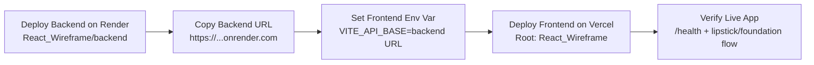

# SkinSignature

## Local Quick Start

### Frontend (from repo root)
```powershell
npm run dev
```

### Frontend build commands
```powershell
npm run build
npm run preview
```

### Backend (from `React_Wireframe/backend`)
```powershell
pip install -r requirements.txt
uvicorn main:app --reload --port 3001
```

### Local app URL
- http://localhost:3000

## Deploy in 10 Minutes (Public URL)

Recommended free-friendly setup:
- Frontend: Vercel
- Backend: Render Web Service

### Option A Sequence (Diagram)



### 1) Deploy Backend (Render)
1. Open https://render.com and sign in with GitHub.
2. Create **New Web Service** from this repo.
3. Configure:
   - Root Directory: `React_Wireframe/backend`
   - Build Command: `pip install -r requirements.txt`
   - Start Command: `uvicorn main:app --host 0.0.0.0 --port $PORT`
4. Deploy and copy backend URL (example: `https://skinsignature-backend.onrender.com`).

### 2) Deploy Frontend (Vercel)
1. Open https://vercel.com and import this repo.
2. Set Root Directory to `React_Wireframe`.
3. Add environment variable in Vercel:
   - `VITE_API_BASE=https://your-backend.onrender.com`
4. Deploy.

You will get a public frontend URL like:
- `https://your-project-name.vercel.app`

### 3) Verify
1. Open backend health endpoint: `https://your-backend.onrender.com/health`
2. Open frontend URL and test one lipstick/foundation flow.

### Deployment Architecture

```text
Users (Browser)
   |
   v
Vercel Frontend (React/Vite)
   |
   | API calls (/v1/*)
   v
Render Backend (FastAPI + OpenCV + MediaPipe)
```

### Notes
- Render free tier may sleep after inactivity; first API call can be slower.
- Frontend supports both `VITE_API_BASE` (preferred) and `VITE_API_URL`.

## More Hosting Options

For easy alternatives (Netlify, Cloudflare Pages, Railway), see:
- `React_Wireframe/EASY_HOSTING_GUIDE.md`


