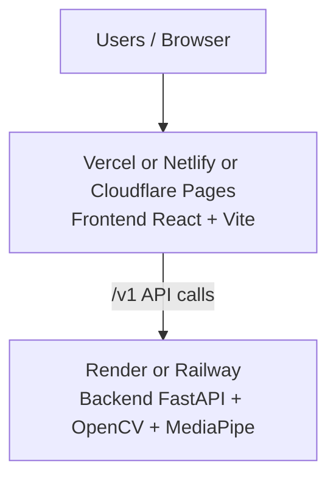
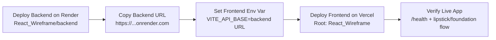

# Easy Public Hosting Guide (Free-Friendly)

This guide gives the fastest ways to host your frontend + backend with a public URL.

## Quick Recommendation

If you want the **simplest reliable path**:
- Frontend: **Vercel** (free)
- Backend: **Render Web Service** (free tier)

This app uses OpenCV/MediaPipe in backend, so full backend on Vercel serverless is not ideal.

## Deployment Flow (Diagram)



---

## Option A (Easiest): Vercel + Render

### Option A Sequence (Diagram)



### 1) Deploy backend on Render
1. Open https://render.com and sign in with GitHub.
2. New → **Web Service** → connect repo.
3. Configure:
	- Root Directory: `React_Wireframe/backend`
	- Build Command: `pip install -r requirements.txt`
	- Start Command: `uvicorn main:app --host 0.0.0.0 --port $PORT`
4. Deploy and copy backend URL, example:
	- `https://skinsignature-backend.onrender.com`

### 2) Deploy frontend on Vercel
1. Open https://vercel.com and import your GitHub repo.
2. Set project root to `React_Wireframe`.
3. In Vercel Project Settings → Environment Variables, add:
	- `VITE_API_BASE=https://skinsignature-backend.onrender.com`
4. Deploy.

You get a public URL like:
- `https://your-project-name.vercel.app`

---

## Option B: Netlify + Render

### Frontend on Netlify
1. Open https://app.netlify.com and import repo.
2. Build settings:
	- Base directory: `React_Wireframe`
	- Build command: `npm run build`
	- Publish directory: `dist`
3. Add environment variable:
	- `VITE_API_BASE=https://skinsignature-backend.onrender.com`
4. Deploy.

### Backend on Render
Use same backend steps from Option A.

---

## Option C: Cloudflare Pages + Render

### Frontend on Cloudflare Pages
1. Open https://dash.cloudflare.com → Workers & Pages → Create application.
2. Connect GitHub repo.
3. Build config:
	- Root directory: `React_Wireframe`
	- Build command: `npm run build`
	- Build output directory: `dist`
4. Set env var:
	- `VITE_API_BASE=https://skinsignature-backend.onrender.com`
5. Deploy.

### Backend on Render
Use same backend steps from Option A.

---

## Option D: Railway (Single provider, still easy)

Railway can host backend very easily. Frontend can be on Railway static service or on Vercel/Netlify.

### Backend on Railway
1. Open https://railway.app and create project.
2. Deploy from GitHub repo.
3. Service settings:
	- Root: `React_Wireframe/backend`
	- Start: `uvicorn main:app --host 0.0.0.0 --port $PORT`
4. Copy backend URL.

### Frontend
Deploy frontend on Vercel/Netlify and set `VITE_API_BASE` to Railway backend URL.

---

## Local Test Before Deploy

From `React_Wireframe`:

```powershell
# backend terminal
cd backend
uvicorn main:app --reload --port 3001

# frontend terminal
cd ..
npm run dev
```

Set local env:

```dotenv
VITE_API_BASE=http://localhost:3001
```

---

## Free Tier Notes (Important)

- Render free web services sleep after inactivity (cold start delay).
- Vercel/Netlify/Cloudflare free tiers are good for frontend static hosting.
- Railway gives free trial/credits; exact free quota can change.

---

## Minimal Deployment Checklist

- Backend deployed and `/health` works publicly.
- Frontend deployed.
- Frontend env var `VITE_API_BASE` points to backend URL.
- Redeploy frontend after env var update.
- Test one lipstick/foundation API flow from live URL.

