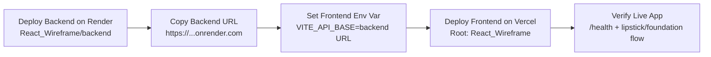

# SkinSignature

## Frontend Quick Start

```powershell
npm install
npm run dev
```

Local URL:
- http://localhost:3000

## Python Backend Setup

1. **Ensure you are using your installed Python 3.10 (not Microsoft Store Python):**
   ```
   where python
   python --version
   ```
   Make sure the path shown is NOT in `WindowsApps` and the version is 3.10.x.

2. **Create and activate a virtual environment:**
   ```
   python -m venv venv
   venv\Scripts\activate
   ```

3. **Install dependencies:**
   ```
   pip install -r requirements.txt
   ```

4. **Run the backend server:**
   ```
   uvicorn main:app --reload --port 3001
   ```

## Deploy in 10 Minutes (Public URL)

Recommended free-friendly setup:
- Frontend: **Vercel**
- Backend: **Render Web Service**

### Option A Sequence (Diagram)



### 1) Deploy Backend (Render)
1. Open https://render.com and sign in with GitHub.
2. Create **New Web Service** from your repo.
3. Use these settings:
   - Root Directory: `React_Wireframe/backend`
   - Build Command: `pip install -r requirements.txt`
   - Start Command: `uvicorn main:app --host 0.0.0.0 --port $PORT`
4. Deploy and copy your backend URL:
   - Example: `https://skinsignature-backend.onrender.com`

### 2) Deploy Frontend (Vercel)
1. Open https://vercel.com and import your repo.
2. Set **Root Directory** to `React_Wireframe`.
3. Add env variable in Vercel project settings:
   - `VITE_API_BASE=https://your-backend.onrender.com`
4. Deploy.

You will get a public frontend URL like:
- `https://your-project-name.vercel.app`

### 3) Verify Live App
1. Open backend health endpoint:
   - `https://your-backend.onrender.com/health`
2. Open frontend URL and test one flow (lipstick/foundation).

### Deployment Architecture

```text
Users (Browser)
   |
   v
Vercel Frontend (React/Vite)
   |
   | API calls (/v1/*)
   v
Render Backend (FastAPI + OpenCV + MediaPipe)
```

### Notes
- Render free tier may sleep after inactivity; first API call can be slower.
- Frontend supports both `VITE_API_BASE` (preferred) and `VITE_API_URL`.

For more provider combinations (Netlify, Cloudflare Pages, Railway), see:
- `EASY_HOSTING_GUIDE.md`